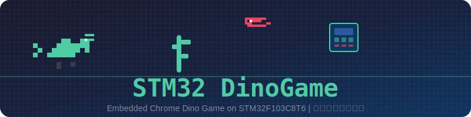
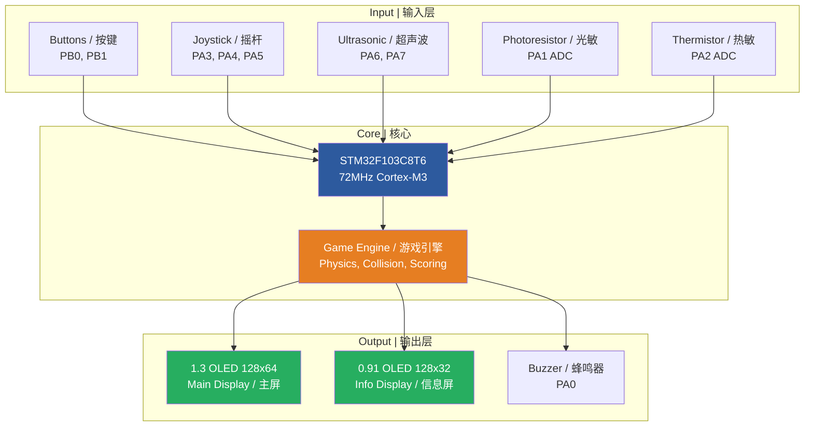
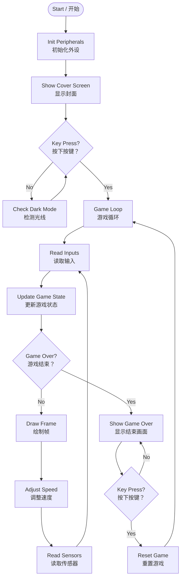
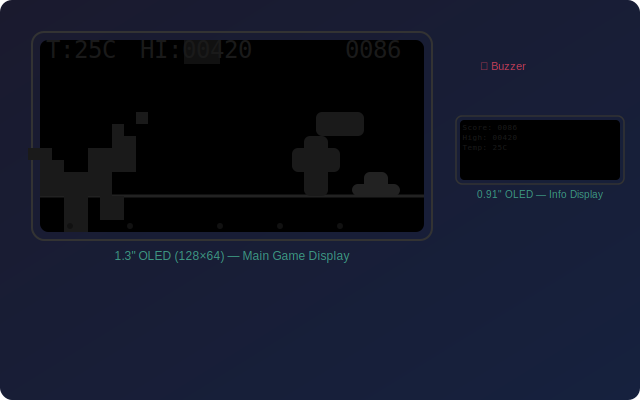
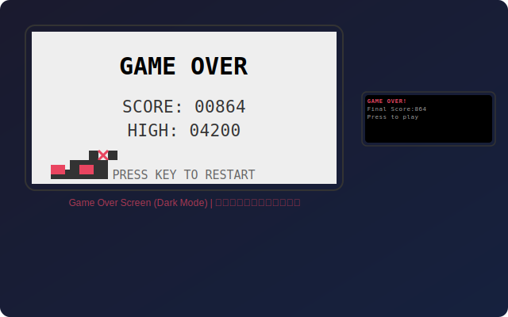
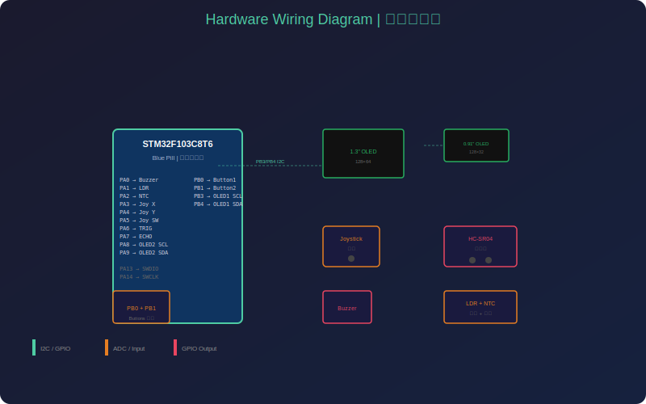

<div align="center">



# 🦖 STM32 DinoGame | STM32 小恐龙游戏

*A Chrome Dino-style game running on STM32F103C8T6 with dual OLED displays, joystick & ultrasonic control, environmental sensing, and dynamic difficulty.*

*基于 STM32F103C8T6 的 Chrome 小恐龙风格游戏，配备双 OLED 屏幕、摇杆与超声波控制、环境感知和动态难度。*

[](https://www.st.com/en/microcontrollers-microprocessors/stm32f103c8.html)
[](https://www.st.com/en/development-tools/stm32cubemx.html)
[](https://www.keil.com/)
[](LICENSE)

</div>

---

## 📖 Table of Contents | 目录

- [Overview | 项目概述](#-overview--项目概述)
- [Hardware | 硬件组成](#-hardware--硬件组成)
- [Pin Connections | 引脚连接](#-pin-connections--引脚连接)
- [System Architecture | 系统架构](#-system-architecture--系统架构)
- [Features | 功能特性](#-features--功能特性)
- [Game Controls | 游戏操作](#-game-controls--游戏操作)
- [Software Structure | 软件结构](#-software-structure--软件结构)
- [Build & Flash | 编译与烧录](#-build--flash--编译与烧录)
- [Demo | 演示](#-demo--演示)

---

## 🎯 Overview | 项目概述

**English:**

STM32 DinoGame is an embedded recreation of the classic Chrome offline dinosaur game. It runs entirely on an STM32F103C8T6 (Blue Pill) microcontroller using bare-metal HAL drivers. The game features a 1.3-inch 128×64 OLED as the main display, a 0.91-inch OLED for auxiliary info, and supports multiple input methods including physical buttons, an analog joystick, and an ultrasonic distance sensor for gesture-based jumping. Environmental sensors (photoresistor + NTC thermistor) enable automatic dark mode and temperature-based speed bonuses.

**中文：**

STM32 小恐龙游戏是对经典的 Chrome 离线恐龙游戏的嵌入式重现。该项目完全运行在 STM32F103C8T6（Blue Pill）微控制器上，使用裸机 HAL 驱动。游戏使用 1.3 寸 128×64 OLED 作为主显示屏，0.91 寸 OLED 作为辅助信息屏，支持按键、模拟摇杆和超声波距离传感器等多种输入方式。环境传感器（光敏电阻 + NTC 热敏电阻）实现了自动暗色模式和基于温度的速度加成。

---

## 🔧 Hardware | 硬件组成

| # | Component | 元件 | Quantity | Purpose |
|---|-----------|------|----------|---------|
| 1 | STM32F103C8T6 (Blue Pill) | 最小系统板 | 1 | Main MCU |
| 2 | 1.3" OLED (128×64) I2C | 1.3寸OLED显示屏 | 1 | Main game display |
| 3 | 0.91" OLED (128×32) I2C | 0.91寸OLED显示屏 | 1 | Score / Info display |
| 4 | Analog Joystick Module | 摇杆模块 | 1 | Jump / Duck / Confirm |
| 5 | HC-SR04 Ultrasonic Sensor | 超声波传感器 | 1 | Gesture jump |
| 6 | Passive Buzzer | 无源蜂鸣器 | 1 | Sound effects |
| 7 | Photoresistor (LDR) | 光敏电阻 | 1 | Ambient light sensing |
| 8 | NTC Thermistor (10K, B=3950) | NTC热敏电阻 | 1 | Temperature sensing |
| 9 | Push Buttons ×2 | 按键 | 2 | Alternative jump / duck |

---

## 📌 Pin Connections | 引脚连接

### Main OLED (1.3" 128×64 I2C)

| OLED Pin | STM32 Pin | Description |
|----------|-----------|-------------|
| SCL | PB3 | I2C Clock |
| SDA | PB4 | I2C Data |
| VCC | 3.3V | Power |
| GND | GND | Ground |

### Secondary OLED (0.91" 128×32 I2C)

| OLED Pin | STM32 Pin | Description |
|----------|-----------|-------------|
| SCL | PA8 | I2C Clock |
| SDA | PA9 | I2C Data |
| VCC | 3.3V | Power |
| GND | GND | Ground |

### Joystick

| Joystick Pin | STM32 Pin | Description |
|-------------|-----------|-------------|
| VRx | PA3 (ADC3) | X-axis (up/down) |
| VRy | PA4 (ADC4) | Y-axis (left/right) |
| SW | PA5 | Button press |
| VCC | 3.3V | Power |
| GND | GND | Ground |

### Ultrasonic (HC-SR04)

| HC-SR04 Pin | STM32 Pin | Description |
|------------|-----------|-------------|
| TRIG | PA6 | Trigger output |
| ECHO | PA7 | Echo input |
| VCC | 5V | Power |
| GND | GND | Ground |

### Buzzer & Sensors & Buttons

| Component | STM32 Pin | Description |
|-----------|-----------|-------------|
| Buzzer | PA0 | PWM sound output |
| Photoresistor | PA1 (ADC1) | Light intensity |
| NTC Thermistor | PA2 (ADC2) | Temperature |
| Button 1 (Jump) | PB0 | Pull-up input |
| Button 2 (Duck) | PB1 | Pull-up input |

---

## 🏗 System Architecture | 系统架构



### Game Loop Flow | 游戏主循环



---

## ✨ Features | 功能特性

### Gameplay | 游戏玩法

- 🦕 **Dino character** with jump & duck animations | 恐龙角色支持跳跃和下蹲动画
- 🌵 **Random cactus obstacles** (3 sizes, 4 variants) | 随机仙人掌障碍物（3种高度，4种变体）
- 🦅 **Bird obstacles** appearing at higher scores | 高分时出现飞鸟障碍
- 📈 **Dynamic difficulty** — speed increases with score | 动态难度 — 分数越高速度越快
- 🏆 **Persistent high score** tracking | 持久化最高分记录
- 🎵 **Sound effects** — jump, score milestone, death | 音效 — 跳跃、得分里程碑、死亡

### Hardware Features | 硬件特性

- 🌗 **Auto dark mode** — OLED inverts when ambient light is low | 自动暗色模式 — 光线暗时 OLED 反色
- 🌡️ **Temperature bonus** — speed increases in hot environments (>30°C) | 温度加成 — 高温环境 (>30°C) 游戏加速
- 📟 **Dual OLED** — main screen for game, secondary for stats | 双 OLED — 主屏玩游戏，副屏显示信息
- 🕹️ **Multi-input** — joystick, buttons, or ultrasonic gesture | 多种输入 — 摇杆、按键或超声波手势
- ⚡ **Ultrasonic jump** — wave hand to make the dino jump | 超声波跳跃 — 挥手即可让恐龙跳跃

---

## 🎮 Game Controls | 游戏操作

| Action | 操作 | Joystick | 摇杆 | Button | 按键 | Ultrasonic | 超声波 |
|--------|------|----------|------|--------|------|------------|------|
| **Jump** | 跳跃 | Push Up ↑ | 上推 | PB0 | | Hand wave < 15cm | 挥手 < 15cm |
| **Duck** | 下蹲 | Push Down ↓ | 下推 | PB1 | | — |
| **Start / Restart** | 开始/重新开始 | Press SW | 按下 | PB0 | | — |

---

## 📁 Software Structure | 软件结构

```
DinoGame/
├── Core/
│   ├── Inc/                    # Header files | 头文件
│   │   ├── main.h              #   Main program header
│   │   ├── gpio.h              #   GPIO configuration
│   │   ├── adc.h               #   ADC configuration
│   │   ├── oled12864.h         #   1.3" OLED driver
│   │   ├── oled091.h           #   0.91" OLED driver
│   │   ├── oledfont.h          #   Font data
│   │   ├── buzzer.h            #   Buzzer driver
│   │   ├── sensor.h            #   Light & temperature sensor
│   │   ├── joystick.h          #   Joystick driver
│   │   ├── ultrasonic.h        #   Ultrasonic driver
│   │   ├── tm1637.h            #   TM1637 4-digit display driver
│   │   └── stm32f1xx_*.h       #   STM32 HAL headers
│   └── Src/                    # Source files | 源文件
│       ├── main.c              #   Game logic & main loop
│       ├── gpio.c              #   GPIO init
│       ├── adc.c               #   ADC init
│       ├── oled12864.c         #   1.3" OLED driver implementation
│       ├── oled091.c           #   0.91" OLED driver implementation
│       ├── buzzer.c            #   Buzzer sound effects
│       ├── sensor.c            #   Sensor reading
│       ├── joystick.c          #   Joystick reading
│       ├── ultrasonic.c        #   Ultrasonic distance measurement
│       ├── tm1637.c            #   TM1637 display driver
│       └── system_stm32f1xx.c  #   System init
├── Drivers/                    # STM32 HAL & CMSIS libraries
├── MDK-ARM/                    # Keil MDK project files
│   ├── DinoGame.uvprojx        #   Keil project
│   └── startup_stm32f103xb.s   #   Startup assembly
├── DinoGame.ioc                # CubeMX project file
├── kill_keil.bat               # Clean build artifacts
└── README.md
```

---

## 🔨 Build & Flash | 编译与烧录

### Prerequisites | 环境要求

- **Keil MDK-ARM** v5.0+ (with STM32F1 device pack)
- **STM32CubeMX** v6.6+ (for code regeneration)
- **ST-Link Utility** or any SWD programmer | 或任意 SWD 烧录器

### Build Steps | 编译步骤

1. Open `MDK-ARM/DinoGame.uvprojx` in Keil MDK
2. Click **Build** (F7) to compile
3. Connect ST-Link to the Blue Pill SWD pins (SWCLK → PA14, SWDIO → PA13)
4. Click **Download** (F8) to flash

```bash
# Alternative: clean build artifacts | 清理构建文件
.\kill_keil.bat
```

### CubeMX Regeneration | CubeMX 重新生成

If you need to modify pin assignments or peripheral settings:

1. Open `DinoGame.ioc` in STM32CubeMX
2. Make your changes
3. Click **Generate Code** (code between `USER CODE BEGIN` / `USER CODE END` comments is preserved)

---

## 📸 Demo | 演示

### Game Screens | 游戏界面

<p align="center">
  
  
</p>

| Screen | Description | 描述 |
|--------|-------------|------|
| 🎮 Gameplay | Game in progress with obstacles | 游戏进行中，躲避障碍物 |
| 💀 Game Over | Game over screen with score | 游戏结束画面，显示分数 |

### Hardware | 硬件

<p align="center">
  
</p>

> 💡 **Tip:** Replace the SVG mockups above with actual photos of your hardware setup for a more impressive README!
> **提示：** 将上方 SVG 示意图替换为实际硬件照片，让 README 更加出彩！

---

## 📄 License | 许可证

MIT License. See [LICENSE](LICENSE) for details.

---

<div align="center">

**Made with ❤️ for the love of embedded systems**

*用对嵌入式的热爱打造*

</div>


